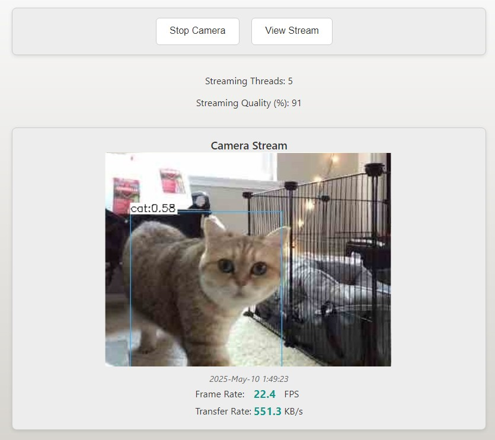

# Simple Web Video Streaming

A lightweight browser-based video streaming solution built with JavaScript and PHP. No complex setup required.

`Not AI generated code`

## Features

- Entirely **browser-based** streaming - no additional server-side or client-side framework needed
- Real-time performance **metrics** (frame rate, bandwidth)
- Adjustable quality settings and thread count
- Cross-browser compatibility
- Integration with YOLO **object detection** in C++

  

    
  

## Installation

1. Configure your own authentication (if needed) and deploy files to your web server
2. Make the `data` directory writable for temporary file exchange
3. Access `index.php` to start streaming and `view.php` URL for viewing
4. For object detection: compile the YOLO C++ code with the provided custom `makefile`

## Folder Structure

| Folder/File    | Description                                       |
| -------------- | ------------------------------------------------- |
| assets/        | CSS and JavaScript files                          |
| data/          | Storage for streaming images                      |
| yolov3-cpp/    | C++ implementation of YOLO object detection       |
| index.php      | Streaming page for broadcasters                   |
| view.php       | Viewing page for audience                         |
| .htaccess      | Server access configuration                       |

## Usage

**Streaming:** Open index.php → Start Camera → Adjust Quality and Frame Rate → Start Streaming

**Viewing:** Open view.php → Start View

**Object Detection:** The system can automatically detect objects in the video stream using YOLOv3. Detected objects (people, cats, dogs) are saved with timestamps in a separate directory.

